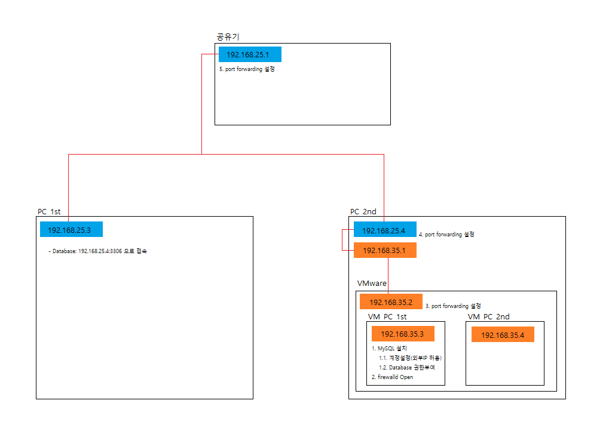

# TIP
---


# Prog
## 1. Java
### 1. GC
#### 1. jinfo
  - JVM option(java command option)을 확인
  - java command option
    - -X는 표준이 아닌 설정으로 Macro한 측면에서 JVM제어 기능을 제공 (모든 JVM에서 지원한다는 보장이 없음)
    - -XX는 표준이 아닌 설정으로 안정적이지 않은 옵션. (-X Option보다 세밀한 제어 기능을 제공하며, 성능 튜닝/버그 Workaround를 위해서 주로 사용됨)
    - -XX:+<옵션>은 해당 옵션을 활성화 -XX:-<옵션>은 해당 옵션을 비활성화
    - -XX:<옵션>=<숫자> 시 'm','M'은 메가바이트 'k','K'는 킬로바이트 'g','G'는 기가바이트를 표현

    - UNIX/Linux/Windows JAVA 5 이상 제공.
    - Heap, PermSize 등 옵션지정 없는 프로세스에 대해 default값 확인 가능.
    - HP-UX에서는 -flag 필수, Linux에서는 -flag없이 pid만 포함하면 해당 프로세스 JVM 전체 정보 출력.
    ~~~
    jinfo -flag [JVMflag] [pid]    // 5555라는 pid의 PermSize를 출력하라 > $JAVA_HOME/bin/jinfo -flag PermSize 5555
    // jinfo -flag PermSize{또는-XX:PermSize=134217728} 5555
    ~~~
    
#### 2. jstat
  - JVM 측정을 위한 성능 통계를 표시한다.
  - 항목 설명
    - Timestamp : JVM의 시작 시간 이후의 시간
    - S0 : Survivor0의 사용률
    - S1 : Survivor0의 사용률
    - E : Eden 영역의 사용률
    - O : Old 영역의 사용률
    - P : Permanent 영역의 사용률
    - YGC : Young generation의 GC 이벤트 수
    - YGCT : Young generation의 가비지 컬렉션 시간
    - FGC : Full GC 이벤트 수
    - FGCT : Full의 가비지 컬렉션 시간
    - GCT : 가비지 콜렉션 시간
  - Options
    - -class : 클래스로드의 동작에 대한 통계
    - -compiler : 핫스팟 컴파일러의 동작의 통계를 표시
    - -gc : 가비지 콜렉트된 힙 영역에 대한 통계
    - -gccapacity : Generation과 해당 공간의 용량 통계
    - -gcutil : 가비지 콜렉션 통계 요약
  - OutputOptions
     - -h [n] : 칼럼 머리글마다 n개의 출력 행 표시 
     - -t : 출력되는 첫번째 칼럼에 타임스탬프 표시 (타임스탬프는 JVM의 시작 시간 이후의 시간이다.)
  ~~~
  // Format: jstat -options -outputoptions [pid] [interval] [count]
  
  jstat -gcutil -h 5 -t 22820 10000 100
  // 22820의 pid에 10초(10000ms)간격으로 100개의 샘플을 취득해 -gcutil 옵션에 따라 출력하라(단 5개 출력 마다 머리글 표시 첫 번째 칼럼엔 타임스탬프를 표시) > jstat -gcutil -h 5 -t 22820 10000 100
  // Result
  Timestamp         S0     S1     E      O      P     YGC     YGCT    FGC    FGCT     GCT   
        1239777.3  32.23   0.00  98.88   1.54  13.76    430  100.417     0    0.000  100.417
        1239787.3  32.23   0.00  99.24   1.54  13.76    430  100.417     0    0.000  100.417
        1239797.3   0.00  36.26  19.20   1.54  13.76    431  100.490     0    0.000  100.490
        1239807.4   0.00  36.26  38.71   1.54  13.76    431  100.490     0    0.000  100.490
        1239817.4  29.82   0.00  15.43   1.54  13.76    432  100.722     0    0.000  100.722
  Timestamp         S0     S1     E      O      P     YGC     YGCT    FGC    FGCT     GCT   
        1239827.4  29.82   0.00  34.67   1.54  13.76    432  100.722     0    0.000  100.722
        1239837.4  29.82   0.00  35.03   1.54  13.76    432  100.722     0    0.000  100.722
        
  // 2행과 3행을 보면 Minor gc가 발생하여 Eden 영역이 감소하고 YGC와 YGCT가 증가함을 볼 수 있다.
  ~~~

#### 3. jstack
  - java Thread dump 생성해주는 명령어로 java stack 확인할 때 사용.
  - Unix/Linux 는 Java 5 부터 Windows 는 Java 6 부터 지원
  - Unix/Linux 에서는 kill -3 명령어로도 Thread dump 생성 가능

  ~~~
  // Format: jstack -l [JVM pid]
  
    jstack -l 4740 > td_4740.txt    // 4740이라는 pid에 대한 Thread dump를 td_4740.txt 라는 파일로 생성하라
  ~~~

#### 4. jmap
  - java Heap dump 생성해주는 명령어로 java Heap을 확인할 때 사용.
  - Options
    -histo : 클래스별 객체 수와 메모리 사용량 확인
    -dump : heap dump 생성

  ~~~
  // Format: jmap [-Options] [JVM pid]
  
  jmap -dump:format=b,file=hd_4740.bin 4740    //4740이라는 pid에 대한 Heap dump를 hd_4740.bin 라는 파일로 생성

  jmap -histo:live 24760    //24760이라는 pid에 대한 클래스별 객체 수와 메모리 사용량을 확인

  jmap -histo:live 24760 | more
  num     #instances         #bytes  class name
  ----------------------------------------------
   1:        327969       19974168  [C
   2:        112277       15139136  <constMethodKlass>
   3:        112277        9886040  <methodKlass>
   4:        330181        7924344  java.lang.String
   5:        176627        7783016  <symbolKlass>
   6:         10189        6167032  <constantPoolKlass>
   7:         97618        4685664  com.sun.tools.javac.zip.ZipFileIndexEntry
   8:         10189        4531304  <instanceKlassKlass>
   9:         46349        3980768  [Ljava.util.HashMap$Entry;
  10:          8970        3606368  <constantPoolCacheKlass>
  ~~~
---


## 2. Database
### 1. Oracle
### 2. MySQL
---


## 3. FrameWork
### 1. Spring Boot
#### 1. Spring Project creating
  - Spring Initializr 사용방법(2가지)
    ~~~
    1. Spring 공식 홈페이지(spring.io)에서 제공하는 기능을 사용합니다.
      1-1. spring.io 접속
      1-2. projects(상단메뉴) > spring boot(조회된 메뉴) > Quick start(상세 탭) > Spring Initializr 이용
       
      2. IDE(Intelli-J, STS 등)에서 제공하는 기능을 사용합니다.
        2-1. 각 tools마다 사용법 상이.
    ~~~
      
  - Spring Initializr Description
    ~~~
    - Project: Maven Project 또는 Gradle Project
      - 빌드, 베포 툴인 Maven과 Gradle 중 택
    - Language: Java, Kotlin, Groovy
    - Spring Boot: Spring Boot의 version
    - Project Metadata: group, artifact 등을 지정합니다.
      - 일반적으로 group은 project의 도메인 및 Default package 경로를 뜻하며, artifact는 프로젝트 명을 암시합니다.
    - Dependencies
      - 프로젝트의 의존성을 추가합니다. (간단히 소프트웨어의 플러그인 정도로 생각하면 됩니다.)
    
  - Spring Boot Config
    - 개념
      - .properties
      - yaml
        - 파일명 또는 경로변경/추가
        ```console
        [user@localhost ~]# java -jar myproject.jar --spring.config.name=myproject.yaml
        --------------------------------------
          - Describe
            - 파일명 변경
        
        
        [user@localhost ~]# java -jar myproject.jar --spring.config.location=classpath:/myproject/{또는 파일명 변경 시, classpath:/myproject/myproject.yaml}
        --------------------------------------
          - Describe
            - 파일경로 변경
        
        
        [user@localhost ~]# java -jar myproject.jar --spring.config.additional-location=classpath:/custom-config/,file:./custom-config/
        --------------------------------------
          - Describe
            - 파일경로 추가
          - Result
            - file:./custom-config/
              classpath:custom-config/
              file:./config/
              file:./
              classpath:/config/
              classpath:/
        ```
      - 환경변수
      - command line args
      
    - 사용방법
    ```console
    [user@localhost ~]# java -jar -Dspring.profiles.active=dev board-0.0.1-SNAPSHOT.jar
    
    또는
    
    [user@localhost ~]# java -jar -Dspring-boot.run.profiles=dev board-0.0.1-SNAPSHOT.jar
    ```
      
  - 참고사이트: [https://www.latera.kr/reference/java/2019-09-29-spring-boot-config-externalize/](https://www.latera.kr/reference/java/2019-09-29-spring-boot-config-externalize/)

### 2. Spring Security

### 3. JPA
#### 1. JPA란
  - Object-Relational Mapping (객체 관계 매핑)
    - 객체지향(Java)과 관계형(RDBMS)과의 패러다임 불일치를 해결(매핑)하는 기술로, 본 문서는 Hibernate를 기준으로 작성.
    
  - JPA의 동작과정
    - [ [ Java Application ]  <-JPA->  [ JDBC API ] ]  <->  [ Database ]
    - Application과 JDBC 사이에 위치하여, 객체지향형과 관계형에 대한 불일치 패러다임을 해소.
    
#### 2. Tech
##### 1. Tech
###### 1. 복합키
  - @EmbededId
    ~~~
    ~~~
    
  - @IdClass
    ~~~
    @Entity
    @Table( name = "TB_USER_ROLE" )
    @IdClass( UserRoleCompositeKey.class )
    public class UserRole{
      @Id
      private User user;
      
      @Id
      private Role role;
    }
    
    public class UserRoleCompositeKey implements Serializable{
      public UserRoleCompositeKey(){
      }
      
      public UserRoleCompositeKey( Long userNo, String roleCd ){
        this.user = userNo;
        this.role = roleCd;
      }
      
      private Long user;    // UserRole Class에 정의된 User ReferenceVariable과 동일한 이름을 사용.
                            // @IdClass는 ReferenceVariable Name으로 UserRole Class에 정의된 ReferenceVariable를 Serche한다.
      private String role;  // UserRole Class에 정의된 Role ReferenceVariable과 동일한 이름을 사용.
                            // @IdClass는 ReferenceVariable Name으로 UserRole Class에 정의된 ReferenceVariable를 Serche한다.
    }
    ~~~
###### 2. 단방향/양방향 Mapping
  - 단방향 Mapping
    ~~~
    ~~~
    
  - 양방향 Mapping
    ~~~
    @Entity
    @Table( name = "TB_COM_USER" )
    public class User{
      @Id
      @Column( name = "USER_NO" )
      private Long userNo;
    }
    
    @Entity
    @Table( name = "TB_COM_ROLE" )
    public class Role{
      @Id
      @Column( name = "ROLE_CD" )
      private String roleCd;
    }
    
    @Entity
    @Table( name = "TB_USER_ROLE" )
    @IdClass( UserRoleCompositeKey.class )
    public class UserRole{
      @Id
      @ManyToOne
      @JoinColumn( name = "USER_NO", referencedColumnName = "USER_NO" )  // UserRole Table에 'USER_NO" 컬럼생성(name 속성)
                                                                         // User Table(referenceVariable의 Class Type 참조)의 'USER_NO' 컬럼참조(referencedColumnName 속성)
      private User user;
      
      @Id
      @ManyToOne
      @JoinColumn( name = "ROLE_CD", referencedColumnName = "ROLE_CD" )  // UserRole Table에 'ROLE_CD" 컬럼생성(name 속성)
                                                                         // Role Table(referenceVariable의 Class Type 참조)의 'ROLE_CD' 컬럼참조(referencedColumnName 속성)
      private Role role;
    }
    
    public class UserRoleCompositeKey implements Serializable{
      public UserRoleCompositeKey(){
      }
      
      public UserRoleCompositeKey( Long userNo, String roleCd ){
        this.user = userNo;
        this.role = roleCd;
      }
      
      private Long user;
      private String role;
    }
    
    - JoinColumn
      - name : 외래키로 정의 할, 자신의 테이블의 컬럼명(Column Name) 설정
      - referencedColumnName : 외래키로 참조할, 대상 테이블의 컬럼명 설정
      - foreignKey(DDL): 외래 키 제약조건명 설정(테이블을 생성조건에만 사용가능)
      - unique : @Column의 속성과 동일
      - nullable : @Column의 속성과 동일
      - insertable : @Column의 속성과 동일
      - updatable : @Column의 속성과 동일
      - columnDefinition : @Column의 속성과 동일
      - table : @Column의 속성과 동일
    ~~~


##### 4. React interlocking

---


## 5. Javascript
### 1. Execution Context(실행 컨텍스트)
  - Javascript의 this, function, hoisting, closure, Scope 등의 동작원리를 담고 있는 핵심원리
  - 실행 가능한 코드를 형상화하고 구분하는 추상적인 개념 -> 실행 가능한 코드가 실행되기 위해 필요한 환경(≒JRE)
    - 실행 가능한 코드란?
      - 전역코드: 전역제 존재하는 코드
      - Eval코드: eval 함수로 실행되는 코드
      - 함수코드: 함수 내에 존재하는 코드
      
  - 
  
### 2. prototype

### 3. function
#### 1. literal(=코드상에 데이터를 표현하는 방식)
  - 익명함수
    ~~~
    // 함수를 정의하고 변수에 저장
    var v = function(x,y) { return x+y; };
    
    // 함수를 정의하고 바로 호출한다.
    var added = (function(x,y) {return x+y;})(1,2);
    ~~~
    
  - 함수선언식(Function Declaration)
    ~~~
    say();  //hoisting 가능
    function say(){
        console.log("hello world!");
    }
    ~~~
    
  - 함수표현식(Function Expression)
    ~~~
    fncSay();   //hoisting 불가능
    const fncSay = function(){
        console.log("hello world!");
    }
    ~~~

### 4. Lexical Scoping(렉시컬 스코프)
  - 외부 -> 내부변수 접근 불가
  - 내부 -> 외부변수 접근 가능
    ~~~
    function outerFunction () {
      const outer = 'outer function!'
        
      function innerFunction() {
         const inner = 'inner function!'
         console.log(outer) // I’m the outer function!
      }
        
      console.log(inner) // Error, inner is not defined
    }
    ~~~
---


## 6. React
### 1. React interlocking in Spring Boot
  - React 앱을 생성
     ~~~
     npm install -i react react-dom
     
     또는
     
     npm install -g create-react-app
     ~~~
     
  - 의존성 추가(Webpack, Babel, Loader)
     ~~~
     npm i webpack webpack-cli @babel/core @babel/preset-env @babel/preset-react babel-loader css-loader style-loader -D
     ~~~
     - babel-loader : 자바스크립트 모듈 번들링을 위한 로더이며, 보통 ES6 코드를 ES5로 변환하기 위해 사용한다.
     - css-loader : 모듈 번들링은 자바스크립트 기반으로 이뤄지기 때문에 CSS 파일을 자바스크립트로 변환하기 위해 사용한다.
     - style-loader : css-loader에 의해 모듈화 되고, 모듈화 된 스타일 코드를 HTML 문서의 STYLE 태그 안에 넣어주기 위해 사용된다.
     - url-loader : 스타일에 설정된 이미지나 글꼴 파일을 문자열 형태의 데이터(Base64)로 변환하여 해당 CSS 파일 안에 포함시켜버리기 때문에 정적 파일을 관리하기 쉬워진다. 하지만 실제 파일들보다 용량이 커지고, CSS 파일이 무거워지므로 적당히 사용하는 것을 권장한다.
     - file-loader : 정적 파일을 로드하는데 사용되며, 보통 프로젝트 환경에 맞게 특정 디렉토리에 파일을 복사하는 역할을 수행한다.
     
  - 의존성 추가(PropTypes, React Router)
     ~~~
     npm install --save prop-types react-router-dom
     ~~~
       - prop-types: React의 Prop를 validation할 때 사용.(React v15.5 부터 다른 패키지로 이동(즉, React.PropTypes사용 불가)하였으며, 현재는 prop-types lib를 사용하는 것을 권고.)
       - react-router-dom: react-router를 의존하고 있기 때문에, 해당 component만 설치한다.
     
### 2. WebPack
  - webpack setting
    * webpack-cli: 터미널에서 webpack 커맨드를 실행할 수 있게 해주는 커맨드 라인 도구.
    - root directory에 'webpack.config.js' file 생성
    - webpack.config.js 작성(파일 참조)
     ~~~
     Source 경로
       - module.exports = {context: path.resolve(__dirname, 'Source 경로') ... }
     Build SRC
       - module.exports = { ... entry: {Build SRC entry: '경로'} ... }
     Build DST
       - module.exports = { ... output: {path: __dirname, filename: '경로'} ... }
     ~~~
      - context: root directory 를 지정한다.
        - entry는 해당 path를 시작으로 진행되나, output은 해당 path를 시작으로 빌드 되지 않는다.(path.resolve(__dirname, 'need path')를 이용) 왜지 ?!
        - ex>
           path.resolve(__dirname, 'src/main/frontend'),
      - resolve: contrext의 대상선정?!
        - ex>
          resolve: {
            extendsion: ['.js', '.jsx']
          }
      - entry: root file로써, entry를 시작으로 필요한 모듈들을 다 불러온 후, 한 파일로 합쳐 bundle.js에 저장.
                추가적으로는 모듈을 통하여 ES6 문법으로 작성된 코드를 ES5 형태로 변환.
        - ex>
          entry: {
            main: './src/App.js'
          }
      - output: 산출물
        - ex>
          const _publicPath = '/public/dist';
          ...
          output: {
            path: path.resolve(__dirname, 'src/main/resources/public/dist'),
            publicPath: _publicPath,
            filename: 'app.bundle.js'
          }
                
  - webpack plug-in
    - clean-webpack-plugin: output으로 지정한 디렉토리를 build할 때마다 삭제하여 주는 plug-in
      ~~~
      npm install --save-dev clean-webpack-plugin
      ~~~
    - html-webpack-plugin: 번들링 시, 기본 HTML문서의 template을 생성해주는 plug-in
      ~~~
      npm install --save-dev html-webpack-plugin
      ~~~
    - html-webpack-root-plugin: html-webpack-plugin을 확장한 plugin으로써, html-webpack-plugin이 생성하는 HTML문서에 elements를 추가할 수 있다.
      ~~~
      npm install --save-dev html-webpack-root-plugin
      ~~~
    - uglifyjs-webpack-plugin: js파일을 난독화 및 압축하여 주는 plug-in
      ~~~
      npm install --save-dev uglifyjs-webpack-plugin
      ~~~
    - helmet: meta information 설정
      ~~~
      npm install --save react-helmet @types/react-helmet
      ~~~
      
#### 1. Example
    ```console
    var path = require('path');
    
    module.exports = {
        context: path.resolve(__dirname, 'src/main/frontend'),
        entry: {
            main: './MainPage.jsx'
        },
        devtool: 'sourcemaps',
        cache: true,
        output: {
            path: __dirname,
            filename: './src/main/webapp/js/react/[name].bundle.js'
        },
        mode: 'none',
        module: {
            rules: [ {
                test: /\.jsx?$/,
                exclude: /(node_modules)/,
                use: {
                    loader: 'babel-loader',
                    options: {
                        presets: [ '@babel/preset-env', '@babel/preset-react' ]
                    }
                }
            }, {
                test: /\.css$/,
                use: [ 'style-loader', 'css-loader' ]
            } ]
        }
    };
    ```
      
      
### 3. UI
#### 1. Meterial-UI
    - Install
      ~~~
      npm install --save @material-ui/core
      ~~~
      
### 4. Transfer
#### 1. Axios
    - Install
      ~~~
      npm install --save axios
      ~~~

## 별첨1. terms
---


## 7. Vue

---

## 8. Python
### 1. Grammar
#### 1. 자료형
##### 1. 기본자료형
    - 숫자
        - 정수[ int ]
        - 실수[ float ]
        - 지수, 8진수, 16진수 등
    - 문자열
    - boolean
    
##### 2. 자료구조
    - 변수
    - 리스트
    - 튜플
    - 딕셔너리
    - 집합

---


## 11. Shell
- Shell 이란
  - User와 Kernel간의 인터페이스 역할을 하는 모듈(ex> 명령어 해석 기능 등)
- Shell의 종류
  - Bourne Shell
    - 유닉스의 표준 쉘
  - Bash Shell
    - Linux 표준 쉘
  - C Shell
  - Korn Shell
- Shell의 확인
  ```console
  [root@localhost ~]# echo $SHELL
  
  또는
  
  [root@localhost ~]# evn | grep SHELL
  oracle:x:1021:1020:Oracle user:/data/network/oracle:/bin/bash
  1      2 3    4    5           6                    7
  --------------------------------------------
- Result
    1 | Username: It is used when user logs in. It should be between 1 and 32 characters in length.
    2 | Password: An x character indicates that encrypted password is stored in /etc/shadow file. Please note that you need to use the passwd command to computes the hash of a password typed at the CLI or to store/update the hash of the password in /etc/shadow file.
    3 | User ID (UID): Each user must be assigned a user ID (UID). UID 0 (zero) is reserved for root and UIDs 1-99 are reserved for other predefined accounts. Further UID 100-999 are reserved by system for administrative and system accounts/groups.
    4 | Group ID (GID): The primary group ID (stored in /etc/group file)
    5 | User ID Info: The comment field. It allow you to add extra information about the users such as user’s full name, phone number etc. This field use by finger command.
    6 | Home directory: The absolute path to the directory the user will be in when they log in. If this directory does not exists then users directory becomes /
    7 | Command/shell: The absolute path of a command or shell (/bin/bash). Typically, this is a shell. Please note that it does not have to be a shell.
  - Description
      - Shell 확인
  ```
### 1. Tech
---


## 12. Groovy
  - 자바 가상 머신에서 작동하는 동적 타이핑 프로그래밍 언어이다.
  - 자바의 강점 위에 파이썬, 루비, 스몰토크등의 프로그래밍 언어에 영향을 받은 특장점을 더하였다.
  - 자바 프로그래머들이 많은 학습을 하지 않고도 최신 프로그래밍 기법을 사용할 수 있다.
  - 도메인 전문 언어와 단순화된 문법을 지원하여 코드가 읽고 유지 보수하기 편해진다.
  
  - 참고사이트: [https://ko.wikipedia.org/wiki/](https://ko.wikipedia.org/wiki/%EC%95%84%ED%8C%8C%EC%B9%98_%EA%B7%B8%EB%A3%A8%EB%B9%84)

---


## 99. Server Setting
### 99.1. Database Server
- Architecture  
 

#### 99.1.1. MySQL 설치
- 참고(MySQL 설치): 

#### 99.1.2. 
- 참고(firewalld 설정): 
    
#### 99.1.3. 
- 참고(VMWare Port Forwarding 설정): 

