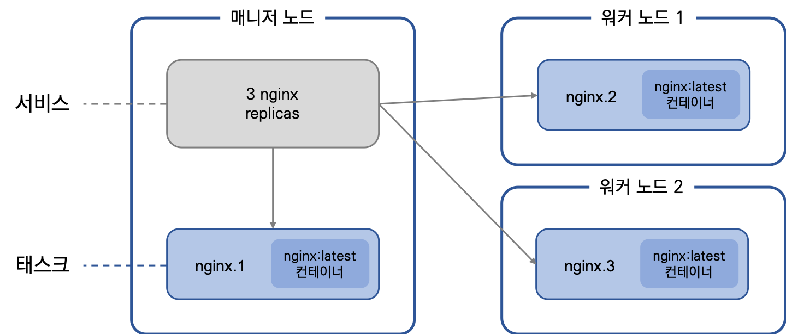
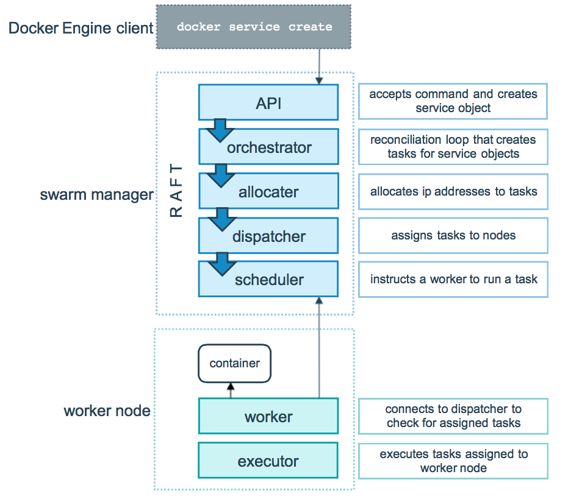

# TIP
---


# CI CD
## 1. Docker
### 1. Docker 란
  - Hypervisor
    - 기존의 가상화 기술로써 가상머신으로 구분하여 운영체제를 관리하기 때문에, Kernel, OS lv의 lib 등 불필요한 기능을 많이 내포하기 때문에 성능에 이슈가 존재한다.
  - Docker
    - Linux 자체기능인 chroot, cgroup, namespace 등을 사용하여, 기존 Hypervisor의 성능이슈를 배제시킨다.
      - chroot: root directory인 '/'를 변경하는 명령어
      - cgroup: Linux Kernel에서 CPU, Memory, DISK, Network 등의 자원을 할당하는 가상화 공간을 제공하는 명령어
      - namespace: Process tree, 사용자계정, file system, ipc 등을 묶어 HOST와 완벽하게 격리시킨 공간

#### 1. Dokcer
  - Docker 위치 확인
  ~~~
  # which docker
  ~~~

  - Docker 실행위치 확인
  ~~~
  # ps aux | grep docker
  ~~~

  - Docker Version 확인
  ~~~
  # docker -v
  Dokcer version xx, build xxx
  ~~~

#### 2. Docker Image [ {저장소이름}/이미지이름:이미지버전 ]
  - Docker Container를 만들기 위한 정보로써, OS 및 Application의 정보를 하나의 정보로 묶어서 관리되는 파일을 뜻한다.

#### 3. Docker HUB
  - Docker Image의 원격저장소(≒ Git HUB)
  
#### 4. Docker Container
  - chroot으로 격리된 공간사용 -> LXC(LinuX Container) 도입 -> Docker 도입
    - chroot: directory만 구분하여 격리된 공간사용.
              설정이 매우 복잡.
    - LXC: group, namespace등을 활용하여, 일종의 Container(OS자체를 가상화하지 않기 때문에 Container라고 명명)
           실제 서비스를 운영하기에는 기능이 부족하였고, 추가하기도 까다로움
    - Docer: good...
    
  - 하나의 Docker Container에는 하나의 Process만 구동시키는 것을 권장
    - ex> 'Docker Container for Web-Server' , 'Docker Container for database' 이렇게 2개의 Docker Container를 구동
    
#### 5. Docker Volume
  - Docker Container의 데이터를 영속적(Persistent)데이터로 활용
  
  - Docker Volume은 3가지 방법을 지원한다.
    - Host Sharing
    - Host -> Volume Docker Container -> Docker Container
    - Docker Volume [권장]
      - Docker 자체적으로 관리하는 Volume을 사용
      
#### 6. Docker Network
  - Docker Network Driver
    - Bridge
    - Host
    - None
    - Container
    - Overlay
  - 3th-party Network Driver(≒PlugIn)
    - weave
    - flannel
    - openvswitch

#### 7. Dockerfile
  - Docker의 Build를 실행 시, 설정정보를 기재하는 파일
  
  - 일반적인 Docker Image만드는 절차
    - [기본 OS Docker Image 다운] -> [Docker Container화] -> [Application 설치 및 셋팅] -> [Docker Container를 Docker Image로 변경]
  - 위의 절차를 하나의 파일로 기재하여, 자동으로 Docker Image를 만드는 행위를 Docker Build라고 하며, 이때 사용하는 File을 Dockerfile이라 한다.

### 2. Command Line Interface
  - Docker Engine
  ```console
  [root@localhost ~]# docker -v
  --------------------------------------
  - Command
      - docker -v
  - Description
      - Docker Engine의 버전을 확인


  [root@localhost ~]# docker inspect web-server
  --------------------------------------
  - Command
      - docker inspect [CONTAINER, IMAGE ...]
  - Option
      --type: 조회 정보를 명시
              ex> docker inspect --type image
                  - Docker Image만 조회
  - Description
      - Docker가 관리하는 Container, Images, Volume 등 Docker의 모든 구성 단위를 조회
  ```


  - Docker Image
  ```console
  [root@localhost ~]# docker images
  --------------------------------------
  - Command
      - docker images
  - Description
      - Local Docker Engine에 존재하는 Docker Images 조회


  [root@localhost ~]# docker pull centos:7
  --------------------------------------
  - Command
      - docker pull IMAGE
  - Description
      - Docker HUB에서 해당 Docker Image를 Download


  [root@localhost ~]# docker rmi web-server
  --------------------------------------
  - Command
      - docker rmi IMAGE
  -f : (Force) 강제삭제
       Docker Container로 사용중인 Docker Image를 -f 옵션으로 삭제했다면, 이름만 none으로 변경된 것(이런 Docker Image를 Dangling Image라고 부름)이며 삭제되지는 않는다.
  - Description
      - Docker Image를 삭제하나, Container가 종료되고 나서 실행하여야 한다.


  [root@localhost ~]# docker image prune
  --------------------------------------
  - Command
      - docker image prune
  - Description
      - dangling image들을 한번에 삭제한다.


  [root@localhost ~]# docker commit \
                      -a "zlagusdbs" \
                      -m "my first commit" \
                      web-server \
                      web-server:first
  --------------------------------------
  - Command
      - docker commit [OPTIONS] CONTAINER [REPOSITORY[:TAG]]
  - Option
      -a : (Author) 작성자를 나타내는 메타데이터를 이미지에 포함
      -m : (Message) Commit Message를 뜻하며, 이미지에 포함될 부가설명이 된다
  - Description
      - web-server라는 Docker Container를 web-server:first라는 이름의 이미지로 생성


  [root@localhost ~]# docker save -o centos.tar centos:7
  --------------------------------------
  - Command
      - docker save [OPTION] FILE_NAME IMAGE
  - Option
      -o : (Output)extract 할 파일명을 입력
  - Description
      - Docker Container의 커맨드, 이미지 이름, 태그 등 이미지의 모든 메타 데이터를 포함하여 하나의 파일로 추출


  [root@localhost ~]# docker load -i centos.tar
  --------------------------------------
  - Command
      - docker load [OPTION] FILE_NAME
  - Option
      -i : (Input)load 할 파일명을 입력
  - Description
      - Docker Container의 커맨드, 이미지 이름, 태그 등 이미지의 모든 메타 데이터를 포함하여 하나의 파일로 추출
  ```


  - Docker Container
  ```console
  [root@localhost ~]# docker ps
  --------------------------------------
  - Command
      - docker ps
  - Optaion
      -a : All Docker container 조회
      -q : Only Docker Container ID만 조회
  - Description
      - 옵션을 기재하지 않을 시, 실행중인 Docker Container를 조회


  [root@localhost ~]# docker create -i -t --name web-server centos:7
  --------------------------------------
  - Command
      - docker create IMAGE
  - Option
      -i : 
      -t : 
      --name : Docker Container의 이름을 지정
  - Description
      - IMAGE를 이용하여 Docker Container 생성
      - [docker pull:Docker Image가 없을 때] -> [docker create]


  [root@localhost ~]# docker run -i -t centos:7
  --------------------------------------
  - Command
      - docker run [Option] IMAGE
  - Option
      -i : 
      -t : 
      -p : Port forwarding을 위한 옵션이며, [SourcePort:DesticationPort] 또는 [SourceIP:SourcePort:DestinationPort]로 기재
           ex> docker run -i -t -p 10.222.52.114:80:8080
               HOST IP인 '10.222.52.114'의 '80' Port로 진입 시, Docker Container의 '8080'Port로 Port forwarding을 진행.
      -d : '-i -t' Option이 attach 가능한 상태로 진입하도록 한다면, '-d'옵션은 Detached Mod로 진입
      -e : Docker Container 내부에서 사용하게 될 Enviroment(환경변수)를 설정
      -v :
           1. Host Sharing
             - Host의 Directory를 Docker Container의 특정 Directory로 공유받는다(≒Volume Sharing)                       //[@Docker Volume]
               ex> docker run --name volume_docker_container -v /home/database:/var/lib/mysql                       //[호스트 공유 디렉토리]:[도커 컨테이너의 디렉토리]
           2. Docker Volume Sharing
             - Docker Volume을 사용한다.
               ex> docker run --name database-server -v docker_volume:/root/                                        //[Docker Vaolume의 이름]:[Docker Container의 공유 디렉토리]
      --volumes-from: '-v'옵션을 사용하는 Docker Container의 '-v'옵션 값에 해당하는 Directory를 공유받는다                  //[@Docker Volume]
                     ex> docker run --name database-server --volumes-from volume_docker_container                   //[@Docker Volume]
                         Host의 '/home/database'의 Directory를 volume_docker_container가 공유받고 있기 때문에, 공유받는 TargetDirectory를 동일한 경로로 다시 공유 받는다.  
      -link[deprecated] : 다른 Docker Container를 Alias를 지정한다.
                          cf> A Docker Container에서 B Docker Container로 접근하는 방법 중 NAT로 받은 IP를 사용하는 방법이 있는데, Docker Egine은 Docker Container를 시작할 때마다 내부IP를 순차적으로 재할당한다.(DHCP개념).
                              매번 변경되는 DockerContainer의 IP를 관리하지 않고, 다른 Docker Container의 이름을 Alias로 지정하여 관리한다.(Docker Container Name또한 변경에 가능성이 있기에, 직접쓰지 않는다.)
                              ex> docker run --name web-server -link database-server:db-srv
                                  db-srv라는 이름으로 database-server Docker Container에 접근할 수 있다.
                          cf> deprecated 옵션이며, Docker Bridge를 사용을 권장한다.
  - Description
      - 'centos:7'라는 Docker Image가 Local Docker Engine에 존재하지 않을 경우, Docker HUB에서 Docker Image를 Download받아 설치 후 Docker Container로 진입
      - [docker pull:Docker Image가 없을 때] -> [docker create] -> [docker start] -> [docker attach: -i -t Option을 사용했을 때]


  [root@localhost ~]# docker start web-server
  --------------------------------------
  - Command
      - docker start CONTAINER
  - Description
      - CONTAINER를 실행


  [root@localhost ~]# docker restart web-server
  --------------------------------------
  - Command
      - docker restart CONTAINER
  - Description
      - CONTAINER를 재실행


  [root@localhost ~]# docker attach web-server
  --------------------------------------
  - Command
      - docker attach CONTAINER
  - Description
      - CONTAINER으로 진입


  [root@container ~]:/# exit
  또는
  Ctrl + D
  --------------------------------------
  - Command
      - exit
  - Description
      - Docker Container를 종료하고, quit


  Ctrl + P, Q
  --------------------------------------
  - Description
      - Docker Container를 종료하지 않고, quit
  ```


  - Docker Volume
  ```console
  [root@localhost ~]# docker volume ls
  --------------------------------------
  - Command
      - docker volume ls
  - Description
      - Docker Volume 조회

  [root@localhost ~]# docker volume create  --name docker_volume
  --------------------------------------
  - Command
      - docker volume create
  - Option
      --name : 
  - Description
      - Docker Volume 생성
  ```


  - Docker Network
  ```console
  [root@container ~]:/# docker network ls
  --------------------------------------
  - Command
      - docker network ls
  - Description
      - Network 목록 조회
  ```


## 2. Docker Swarm
### 1. Dokcer Swarm
  - 여러 대의 도커 서버를 하나의 클러스터로 만들어 Docker Container를 생성하는 여러 기능을 제공.
  - Swarm Class과 Swarm Mode로 나뉨
    - Swarm Class(Legacy)
      - Swarm Class은 여러 대의 서버를 하나의 지점에 사용하도록 단일 접근점을 제공하는것에 초점을 맞춤
      - Docker Version 1.6 이후 사용
      - 분산 코디네이션과 에이전트 등이 별도로 실행돼야 한다.
    - Swarm Mode
      - Swarm Mode는 MSA Container를 다루기 위한 클러스터링에 초점을 맞춤
      - Docker Version 1.12 이후 사용
      - 분산 코디네이션과 에이전트 등이 엔진에 내장돼어있다.
      
    cf> 분산 코디네이션(Distributed Coordinator)
      - 분산 코디네이션이란, 여러 개의 도커 서버를 하나의 클러스터로 구성하기위해 각종 정보를 저장하고 동기화를 관리하는 기술을 뜻함.
      - 또한, 클러스터에 영입할 새로운 서버의 발견(Service Discovery), 클러스터의 설정 저장, 동기화 등 을 위한 매니저를 뜻하기도 한다.
      - etcd, zookeeper, consul 등이 대표적이다.
  
  
#### 1. Swarm Classic
  - 생략(교재에서 생략되었다.)
  
  
#### 2. Swarm Mode
  - 구조
    - Manager Node
      - 기본적으로 Worker Node를 포함하며, Worker Node를 관리하기 위한 Docker Server
      - HA를 위하여, Raft Consensus 알고리즘을 사용.
    - Worker[1...N] Node
      - 실제로 Docker Container가 생성되고 관리되는 Docker Server
      
      
#### 3. Swarm Mode Service
  - Architecture
  
  
  - Tasks and scheduling
  
  
  - Service
    - Swarm Mode에서의 제어 단위

  - Replica
    - Task들을 함께 묶은 정보
    
  - Task
    - Node 안에 몇가지 기능(제어를 당하기 위한기능)과 Docker Container를 채울수 있는 Slot의 묶은 단위를 뜻하며, 채워진(Swarm Mode를 위하여 인스턴스화 된) Docker Container를 뜻하기도 한다.


  - Service란
    - Swarm Mode에서 제어하는 단위
    - 명령어를 실행하면, Service에 묶인 모든 Docker Container들은 같은 명령어를 수행한다.
  - Task
    - Service내에 Docker Containier를 뜻한다.
  - Replica
    - Task들이 Manager Node 또는 Worker Node에 할당이 된 상태 


### 2. Command Line Interface
  - Swarm Mode (명령어의 제어 단위는 Docker Container)
  ```console
  [root@localhost ~]# docker info | grep Swarm
  --------------------------------------
  - Command
      - docker info
  - Description
      - Docker Engine의 Swarm Mode Cluster 정보를 확인


  [root@managernode ~]:/# docker node ls
  --------------------------------------
  - Command
      - docker node ls
  - Description
      - Swarm Cluster에 등록된 Node들을 조회


  [root@managernode ~]:/# docker swarm init --advertise-addr 192.168.0.100
  --------------------------------------
  - Command
      - docker swarm init
  - Options
      --advertise-addr: Docker Server가 Manager Node에 접근할 수 있도록 IP를 noti 
  - Description
      - Manager 역할을 할 서버에 Swarm Cluster를 시작


  [root@managernode ~]:/# docker swarm join --token SWMTKN-1-5...
  --------------------------------------
  - Command
      - docker swarm join
  - Options
      --token: 해당 Swarm Cluster에 추가하기 위한 비밀키
  - Description
      - 새로운 Worker Node를 해당 Swarm Cluster에 추가


  [root@managernode ~]:/# docker swarm join-token first-worker-node
  --------------------------------------
  - Command
      - docker swarm join-token NODE_NAME
  - Description
      - Node의 token을 확인


  [root@first-worker-node ~]:/# docker swarm leave  --force
  --------------------------------------
  - Command
      - docker swarm leaver
  - Options
      --force: Manager Node는 해당 옵션을 추가해야만 삭제할 수 있다.
               Manager Node를 삭제하면 해당 Manager Node에 저장돼 있던 Cluster 정보도 삭제된다.(주의!)
  - Description
      - Swarm Mode를 해제한다.


  [root@first-worker-node ~]:/# docker swarm rm
  --------------------------------------
  - Command
      - docker swarm rm
  - Description
      - 해제된 Swarm Mode를 삭제한다.


  [root@managernode ~]:/# docker swarm promote first-worker-node
  --------------------------------------
  - Command
      - docker swarm promote first-worker-node
  - Description
      - first-worker-node Worker Node를 Manager Node로 변경


  [root@managernode ~]:/# docker swarm demote first-worker-node
  --------------------------------------
  - Command
      - docker swarm demote first-worker-node
  - Description
      - first-worker-node Manager Node를 Worker Node로 변경
  ```


  - Swarm Mode Service
  ```console
  // K8S로 바로 넘어가며, 다르지 않음.
  ```