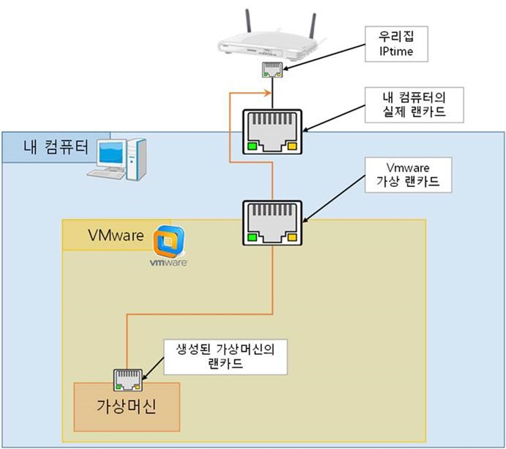
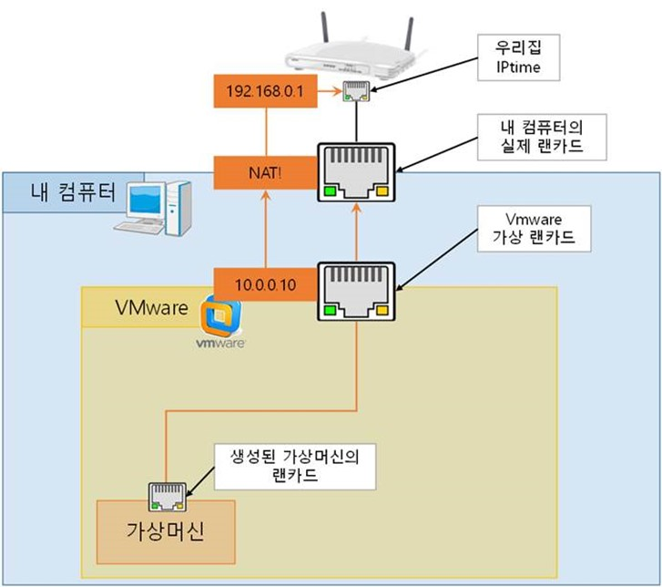
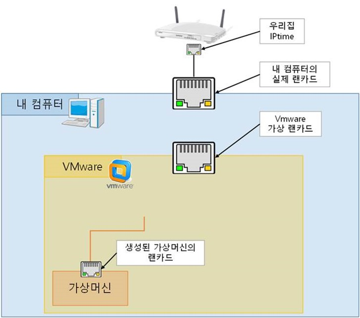

# TIP

---

# ETC
## 1. VMWare
### 1.1. VMWare VMNet
#### 1.1.1. Type
- Bridged: Guest operation system(가상머신)에 외부 네트워크(내 컴퓨터의 랜카드)로 다이렉트  
  
  

- NAT  
  

- host-only  
  
  

- don't network  
  
		
> 출처: https://ryusstory.tistory.com/entry/Vmware-Network-Type-에-대해서-알아봅시다 [Ryu's Story]
---

